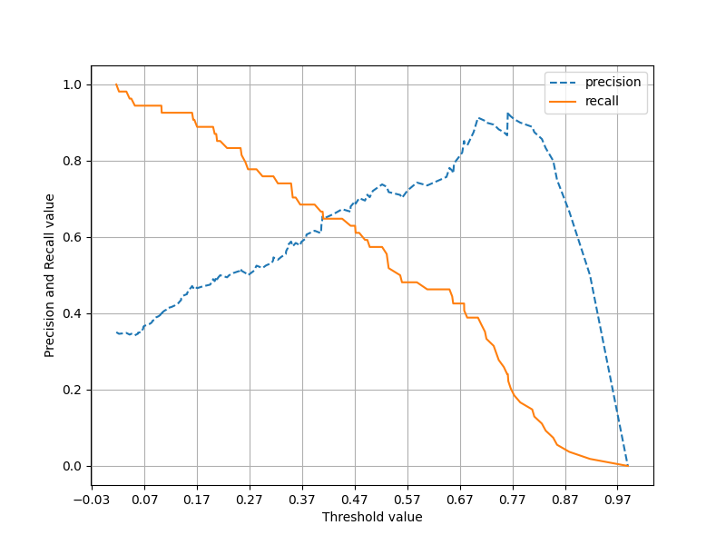

# Machine Learning  
basic of machine learning  
October Start  
```
10-04 : irisdataset with sklearn & used k-fold, GridSerchCV  
        OneHotEncoder, LabelEncoder, StandardScaler, MinMaxScaler
```

```
10-05 : Sensitivity & Specificity, Precision & Recall with Threshold 
        PimaIndianDiabetes with Tune Dataset
```
>  
정밀도(precision) -> 목표를 달성  
재현율(recall) -> 목적을 달성  
f1 스코어 -> 2 * (prescision * recall) / (precision + recall)  
  
>ROC 곡선  

Y축 = 재현율  
X축 = 오답율  
AUC = 1에 가까울수록 좋은 모델(왼쪽 구석으로 갈수록 좋은 모델)  
