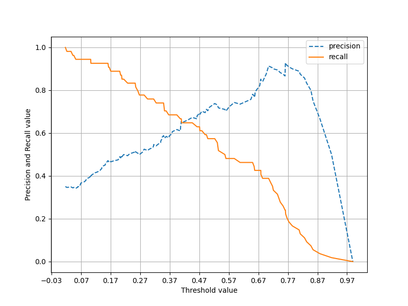

# Machine Learning  
basic of machine learning  
October Start  
```
10-04 : irisdataset with sklearn & used k-fold, GridSerchCV  
        OneHotEncoder, LabelEncoder, StandardScaler, MinMaxScaler
```

```
10-05 : Sensitivity & Specificity, Precision & Recall with Threshold 
        PimaIndianDiabetes with Tune Dataset
```
